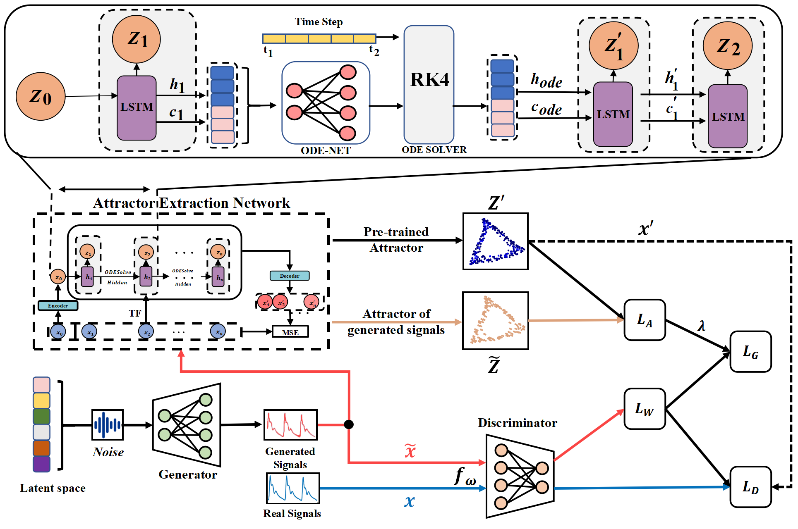

# AC-GAN: Advancing Stress Detection with Chaotic Attractor Informed Synthesis of PPG Signal

## Overview

We introduce AC-GAN, a novel generative adversarial network for PPG synthesis with data-driven attractor constraints.  AC-GAN comprises two distinct components: a data-driven attractor extraction network and the GAN with attractor constraints. We first designed a recurrent neural network (RNN), which can continuously update its hidden states, to extract the chaotic motion characteristics of real PPG signals in a purely data-driven mode. Subsequently, the pre-trained attractor extraction network is used as a prior in the optimization process of a GAN to create PPG signals that conform to the underlying dynamics of physiological systems.

Our basic implementation of AC-GAN is provided in this repository.


## Environment

python 3.6.6

torch=1.10.2+cu113

torchdiffeq=0.2.3

...

scikit-learn==0.24.2

For more information, please see requirement.txt

## Function

``clean_bvp_all``  It provides the denoised raw data from the UBFC dataset.

``datasets`` It provides the partitioned UBFC data and Lorenz data.

``ppg_clean.py`` It is used for denoising the signal and downsampling it to 32 Hz.

``rp_py.py``  It is used to calculate the relevant parameters for phase space reconstruction of the signal, with dim using FNN and tau using AIM.

``attractor_extract.py``  It is the entry point of the attractor extraction network, with the functional details available in the bptt folder.

``Lyapunov.py`` It is used to calculate the Lyapunov exponent.

``createFigure.py``  It is used to visualize the attractor results.

``AC-GAN.py`` It is used to train the generative adversarial network constrained by attractors.This includes the function for generating samples.

``wgan_base.py`` The WGAN network without attractor constraints, which has the same generative adversarial network structure as in AC-GAN, is used for ablation experiments.

``evaluate.py``  It is used for quantitatively evaluating the similarity between generated signals and real signals, including the calculation of MMD, MSE, DTW, and MIC.

``feature_extract.py``  It is used to extract the nonlinear features of the signal, thereby quantitatively evaluating the signal similarity.

``trainer.py`` For stress recognition of the signal, used in signal usability studies, the classifier employs the initially configured SVM classifier, and the experimental setup follows the TSTR guidelines.

``temp_plot.py``  It is used for significance testing, employing the Friedman significance test with p=0.05.

## Citation

[Link to Paper](https://ieeexplore.ieee.org/abstract/document/11356883)

If you use this code or find our work helpful in your research, please consider citing our paper:

**BibTeX:**
```bibtex
@inproceedings{hu2025advancing,
  title={Advancing Stress Detection with Chaotic Attractor Informed Synthesis of PPG Signal},
  author={Hu, Kaiwen and Zhang, Sipo and Zhang, Xiaowei and Zhao, Qiqi and Gao, Guangyuan and Wang, Tianzhi and Shen, Jian and Hu, Bin},
  booktitle={2025 IEEE International Conference on Bioinformatics and Biomedicine (BIBM)},
  pages={6178--6185},
  year={2025},
  organization={IEEE}
}
```
