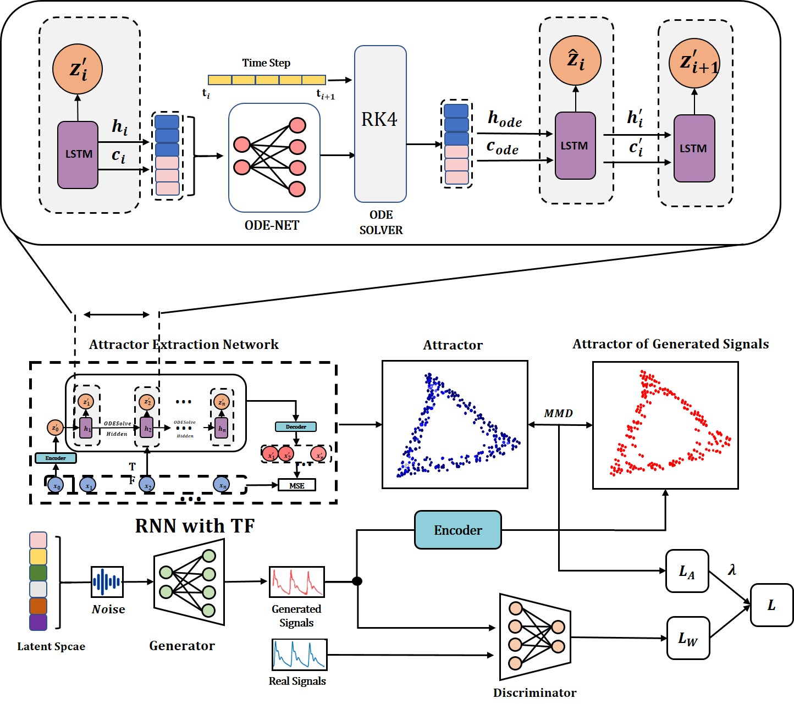

# AC-GAN: Integrating Attractor Constraints into Generative Adversarial Networks for Dynamic PPG Synthesis

## Overview

We introduce AC-GAN, a novel generative adversarial network for PPG synthesis with data-driven attractor constraints.  AC-GAN comprises two distinct components: a data-driven attractor extraction network and the GAN with attractor constraints. We first designed and pre-trained an attractor extraction network to represent the attractor characteristics of PPG signals. Then we incorporate this component into the GAN framework and develop specialized loss functions.

Our basic implementation of AC-GAN is provided in this repository.

## Environment

python 3.6.6

torch=1.10.2+cu113

torchdiffeq=0.2.3

...

scikit-learn==0.24.2

For more information, please see requirement.txt

## Function

``clean_bvp_all``  It provides the denoised raw data from the UBFC dataset.

``datasets`` It provides the partitioned UBFC data and Lorenz data.

``ppg_clean.py`` It is used for denoising the signal and downsampling it to 32 Hz.

``rp_py.py``  It is used to calculate the relevant parameters for phase space reconstruction of the signal, with dim using FNN and tau using AIM.

``attractor_extract.py``  It is the entry point of the attractor extraction network, with the functional details available in the bptt folder.

``Lyapunov.py`` It is used to calculate the Lyapunov exponent.

``createFigure.py``  It is used to visualize the attractor results.

``AC-GAN.py`` It is used to train the generative adversarial network constrained by attractors.This includes the function for generating samples.

``wgan_base.py`` The WGAN network without attractor constraints, which has the same generative adversarial network structure as in AC-GAN, is used for ablation experiments.

``evaluate.py``  It is used for quantitatively evaluating the similarity between generated signals and real signals, including the calculation of MMD, MSE, DTW, and MIC.

``feature_extract.py``  It is used to extract the nonlinear features of the signal, thereby quantitatively evaluating the signal similarity.

``trainer.py`` For stress recognition of the signal, used in signal usability studies, the classifier employs the initially configured SVM classifier, and the experimental setup follows the TSTR guidelines.

``temp_plot.py``  It is used for significance testing, employing the Friedman significance test with p=0.05.
